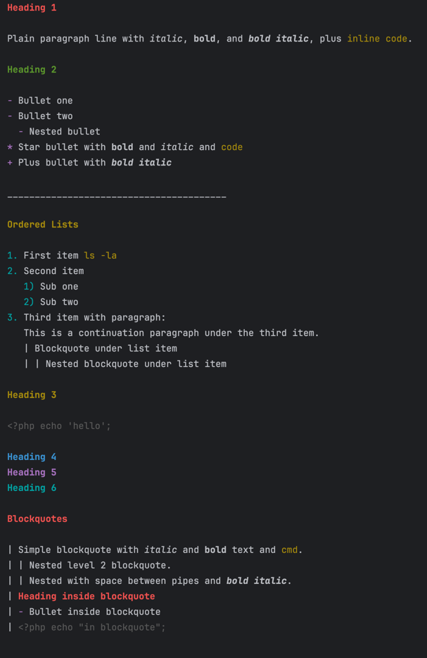

# Chalkmark


----

Render Markdown right in your terminal — headings, colors, lists, code blocks

----

## Chalkmark supports 

Chalkmark is a small PHP library that renders a large subset of Markdown to plain-text suitable for CLI output, 
with optional ANSI colors. It is designed to be lightweight and dependency-free. An example of the terminal output is 
shown at the end of this README.

It supports:

- Headings `#` ... `######` (levels 1–6)
- Horizontal rules as 40+ underscores on a line
- Unordered lists using `-`, `*`, or `+` (with indentation)
- Ordered lists like `1.` or nested `1)` … (with indentation)
- Paragraphs with inline formatting:
    - code using backticks: `` `code` ``
    - _italic_: `*text*` or `_text_`
    - **bold**: `**text**` or `__text__`
    - ***bold+italic***: `***text***` or `___text___`
- Code blocks fenced by backticks:  `` ```code``` ``
- Blockquotes using a pipe-prefix syntax: `| quote` with nesting like `| | nested`
- Tables using pipe syntax (GitHub-style). Table blocks are normalized: column widths are computed, cells are padded, and alignment markers (`:---`, `:---:`, `---:`) control left/center/right alignment. The separator line is rendered with dashes only (colons are not shown).

Notes on header background bars (reversed theme):
- When using the `reversed` theme, heading lines (h1–h6) are rendered with a colored background.
- The colored background extends to the terminal width when Chalkmark can determine it via the `COLUMNS` environment variable.
- If the terminal width is unknown, Chalkmark pads the colored bar to `max(60, visible heading length)` characters.
- This background fill applies only when the active heading style actually includes a background color and colors are enabled; other themes are unaffected.

Rendered output ends with a trailing newline and ensures there is a blank line at the end.

## Overview

- Language/stack: PHP 8.2+
- Package manager: Composer
- Test framework: PHPUnit 11
- Autoloading: PSR-4
- Demo script: `tests/show-fixture-markdown.php` & `tests/show-own-readme.php`

## Requirements

- PHP >= 8.2
- Composer (for installation and dev tooling)

## Installation

This package is a Composer library. From a project that uses Composer, you can install it with:

```
composer require tetrode/chalkmark
```

Note: The package name is taken from `composer.json` (`tetrode/chalkmark`). 

## Usage

Minimal example rendering a file and printing to STDOUT:

```php
<?php
use Chalkmark\Chalkmark;

require __DIR__.'/../vendor/autoload.php';

$renderer = new Chalkmark();
$renderer->displayFile(__DIR__ . '/README.md', STDOUT);

```

Customizing colors or disabling them:

```php
<?php

use Chalkmark\Chalkmark;

$colors = [
    'h1' => "\033[1;34m",     // bright blue bold
    'bullet' => "\033[36m",   // cyan for list bullets
    'code_inline' => "\033[33m", // yellow for inline code
    // set any color key to '' (empty) to remove coloring for that element
];

$renderer = new Chalkmark($colors, $enableColors = true);

// Disable all colors (useful for logs or tests):
$rendererNoColor = new Chalkmark([], false);
```

### Theming

Chalkmark supports themes. A theme is a simple associative array mapping style keys to ANSI escape sequences. The default theme mirrors the legacy built-in colors.

- Built-in themes:
  - `default` — classic Chalkmark palette
  - `monochrome` — disables all colors
  - `reversed` — headers with bright white on colored backgrounds (full‑width bars)
  - `banner` — strong background bars for headers (like reversed, different aesthetic)
  - `nord` — cool, subdued blues/cyans; calm aesthetic
  - `dracula` — vibrant magenta/green/yellow with cyan accents; strong contrast
  - `gruvbox-dark` — warm earthy yellow/orange/aqua tones; developer friendly
  - `solarized-dark` — classic blue/cyan/green/yellow; balanced contrast (16‑color)
  - `pastel-light` — soft rose/peach/mint/sky tones for light terminals
- Select a theme via the third constructor argument:

```php
use Chalkmark\Chalkmark;

// Use the built-in monochrome theme but keep colors enabled (no ANSI will be emitted):
$renderer = new Chalkmark([], true, 'monochrome');

// Use default theme but override some keys:
$overrides = [
    'h1' => "\033[1;34m",     // bright blue bold
    'bullet' => "\033[36m",   // cyan
];
$renderer = new Chalkmark($overrides, true, 'default');

// Use reversed theme: like default but headers (h1..h6) use bright white (no bold)
// on colored backgrounds (red, green, yellow, blue, magenta, cyan).
// The background bar will expand to the terminal width (from $COLUMNS),
// or to max(60, header length) if the terminal width is unknown.
$renderer = new Chalkmark([], true, 'reversed');
```

Theme Gallery (quick preview):

```php
<?php
use Chalkmark\Chalkmark;
use Chalkmark\Theme\ThemeRegistry;

require __DIR__.'/vendor/autoload.php';

$sample = <<<MD
# Heading 1

## Heading 2

### Heading 3

Paragraph with *italic*, **bold**, and `inline code`.

- Bullet one
- Bullet two
MD;

foreach (ThemeRegistry::listBuiltins() as $name) {
    echo "\n==== Theme: {$name} ====\n";
    $renderer = new Chalkmark([], true, $name);
    echo $renderer->renderString($sample);
}
```

Notes on 256‑color usage:
- Some themes (e.g., nord, dracula, gruvbox-dark, pastel-light) use 256‑color SGR codes (`38;5;NN`). Most modern terminals support these; if your terminal does not, switch to `default`, `monochrome`, or `solarized-dark` for maximum portability.

You can also provide your own theme:

1) Register at runtime:

```php
use Chalkmark\Theme\ThemeRegistry;

ThemeRegistry::register('mytheme', [
    'h1' => "\033[1;35m",
    'text' => "\033[0m",
    // ... other keys
]);

$renderer = new Chalkmark([], true, 'mytheme');
```

2) Load from a PHP file that returns an array:

```php
// mytheme.php
return [
    'h1' => "\033[1;35m",
    'text' => "\033[0m",
];

// usage
$renderer = new Chalkmark([], true, __DIR__.'/mytheme.php');
```

Override precedence: built-in theme < registered/file theme < per-run `$colors` overrides. Setting an override value to `''`, `false`, or `null` disables that style.

## Command-line demo

This repository includes a tiny demo script you can run locally after installing dependencies:

```
composer install
php tests/show-markdown.php
php tests/show-own-readme.php
```



### Table example

Input:

```
| Left aligned | Centered | Right aligned |
|:-------------|:--------:|--------------:|
| Apple        | Red      |           10 |
| Banana       | Yellow   |            2 |
| Cherry       | Dark Red |            6 |
```

Output (no colors):

```
| Left aligned | Centered | Right aligned |
| ------------ | -------- | ------------- |
| Apple        |   Red    |            10 |
| Banana       |  Yellow  |             2 |
| Cherry       | Dark Red |             6 |
```

## Environment variables

No environment variables are required or used by the library.

## Running tests

PHPUnit is configured as a dev dependency. After `composer install` you can run:

```
./vendor/bin/phpunit
```

Tests include both behavior assertions and a demonstration that writes rendered output to the CLI.


## License

Chalkmark is made available under the MIT License (MIT). Please see [License File](LICENSE) for more information.

